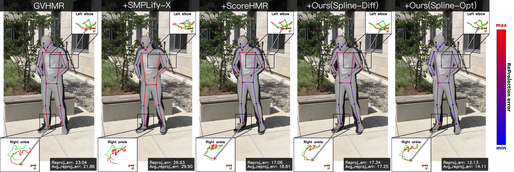
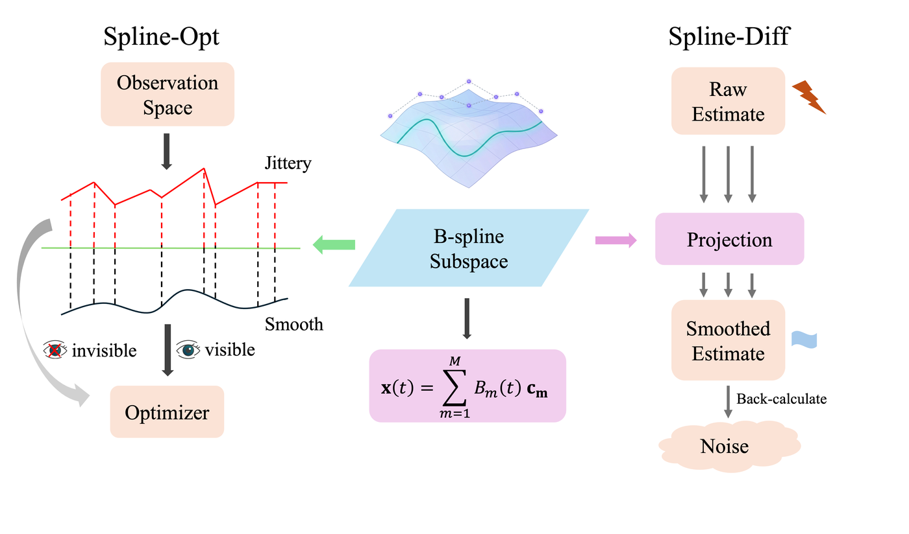
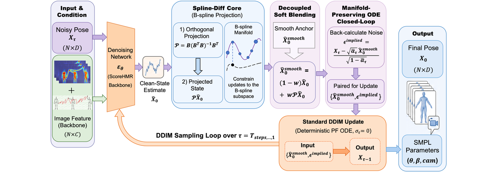

# SplineHMR

Demo code for SplineHMR. This first open-source slice focuses on inference from precomputed GVHMR outputs:

<p align="center">
  <a href="https://yizhitutuqiu.github.io/SplineHMR_Page/">Project Page</a> ·
  <a href="https://www.youtube.com/watch?v=BntuG1ZOT6g">Video</a> ·
  <a href="https://github.com/yizhitutuqiu/SplineHMR">Code</a> ·
  <span>Paper (soon)</span>
</p>


- Spline-Opt: B-spline control-space LBFGS refinement.
- Spline-Diff: ScoreHMR sampling with B-spline temporal projection.

<p align="center">
  
</p>

<p align="center"><em>SplineHMR improves temporal stability and fitting quality for human mesh recovery through Spline-Opt and Spline-Diff.</em></p>

<p align="center">
  
</p>

<p align="center"><em>Demo teaser: red = before optimization, green = after Spline-Opt.</em></p>

<p align="center">
  
</p>

<p align="center"><em>Additional Spline-Opt demo on <code>inputs/climbing_2_3mb</code>.</em></p>

<details>
<summary>Method schematics</summary>

<p align="center">
  
</p>

<p align="center">
  
</p>

</details>

Runtime code and assets are kept inside this repository. Spline-Opt starts from precomputed `hmr4d_results.pt` and does not require a full GVHMR checkout; only local SMPL/SMPLX body-model assets are required for optimization/rendering.

## Demo Inputs

By default, the demo uses `inputs/climbing_3mb`. You can choose another prepared input with `--input_dir` or the shorter `--input`. The argument may point either to the input directory or directly to its `0_input_video.mp4`; in the latter case SplineHMR uses the video's parent directory.

Each input directory should follow this structure:

```text
inputs/<sequence_name>/
├── 0_input_video.mp4
├── hmr4d_results.pt
└── preprocess/
    ├── bbx.pt
    └── vitpose.pt
```

Bundled examples include:

```text
inputs/climbing_3mb
inputs/climbing_2_3mb
```

## Installation And Assets

The validated environment flow is documented in [docs/DEPLOYMENT.md](docs/DEPLOYMENT.md). In short, we currently recommend cloning the working `gvhmr` conda environment and installing SplineHMR in editable mode:

```bash
conda create -n splinehmr --clone gvhmr -y
conda activate splinehmr
cd /root/autodl-tmp/work/SplineHMR/SplineHMR
python -m pip install -e .
```

Dependency metadata is provided in:

```text
requirements.txt
requirements-scorehmr.txt
environment.yml
pyproject.toml
```

SMPL/SMPL-X body models are license-gated and must be downloaded by the user. Required paths are:

```text
assets/body_models/smpl/SMPL_NEUTRAL.pkl
assets/body_models/smplx/SMPLX_NEUTRAL.npz
```

ScoreHMR source/weights are required only for Spline-Diff. Full asset instructions are in [docs/MODEL_ASSETS.md](docs/MODEL_ASSETS.md).

Check the prepared assets with:

```bash
python scripts/check_assets.py --method spline-opt
python scripts/check_assets.py --method spline-diff
```

## Run Spline-Opt

Use the validated `splinehmr` conda environment:

```bash
cd /root/autodl-tmp/work/SplineHMR/SplineHMR
conda run -n splinehmr python -m splinehmr.demo --method spline-opt
```

Run Spline-Opt on another bundled input:

```bash
conda run -n splinehmr python -m splinehmr.demo \
  --method spline-opt \
  --input_dir inputs/climbing_2_3mb
```

Spline-Opt defaults are copied from GVHMR's demo postprocess config used by `--enable-bspline-refine`, now stored at `configs/spline_opt.yaml`. Important defaults include `m_per_t: fps_div_2`, `max_iter: 60`, `amp_*: 1.0`, `prior_w_body_pose: 0.1`, `prior_w_global_orient/transl: 0.2`, `smooth_w: 0.02`, `static_motion_w: 2`, and `optimize_pose_in_rot6d: true`.

Optional quick test:

```bash
conda run -n splinehmr python -m splinehmr.demo --method spline-opt --max_frames 60 --max_iter 20
```

## Run Spline-Diff

```bash
cd /root/autodl-tmp/work/SplineHMR/SplineHMR
conda run -n splinehmr python -m splinehmr.demo --method spline-diff
```

Run Spline-Diff on another bundled input:

```bash
conda run -n splinehmr python -m splinehmr.demo \
  --method spline-diff \
  --input_dir inputs/climbing_2_3mb
```

Spline-Diff defaults are stored in this repository at `configs/spline_diff.yaml`. The demo reads this YAML by default and passes the resolved values into the patched ScoreHMR sampler, so users do not need to edit files under `third_party/ScoreHMR`. Important defaults mirror the current modified ScoreHMR tree: `m_per_t: fps_div_3`, `blend_weight: 0.6`, `use_tanh: true`, `tanh_amp: 10.0`, and `optim_iters: 2`.

Optional config overrides:

```bash
conda run -n splinehmr python -m splinehmr.demo --method spline-diff \
  --spline_diff_config configs/spline_diff.yaml \
  --m_per_t fps_div_4 \
  --scorehmr_blend_weight 0.4
```

ScoreHMR outputs are treated as SMPL, not SMPLX. For Spline-Diff rendering, the demo uses SMPL directly, padding/cropping body pose to 69D, matching the special handling used in the original bss-smplify pipeline.

## Outputs

For either method, outputs are written to `outputs/<input_name>/<method>/`:

```text
hmr4d_results_before.pt
hmr4d_results.pt
render_before.mp4
render_after.mp4
render_compare.mp4
render_overlay_compare.mp4
report.json
```

`render_compare.mp4` is the side-by-side comparison. `render_overlay_compare.mp4` overlays both meshes in one frame: red is before optimization and green is after optimization, with a legend.

The `hmr4d_results.pt` file keeps the original GVHMR-style dict layout, with refined `smpl_params_incam` values.
